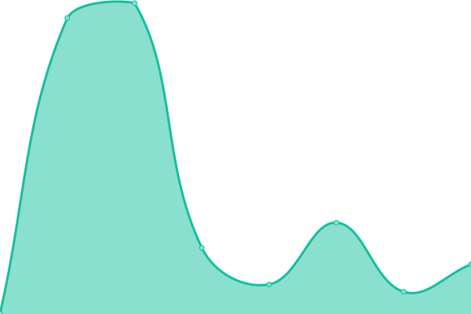

# [📈 Live Status](https://leafle.github.io/mki-api-upptime): <!--live status--> **🟧 Partial outage**

This repository contains the open-source uptime monitor and status page for [Brandon Smyth](https://leafle.github.io/mki-api-upptime), powered by [Upptime](https://github.com/upptime/upptime).

With [Upptime](https://upptime.js.org), you can get your own unlimited and free uptime monitor and status page, powered entirely by a GitHub repository. We use [Issues](https://github.com/leafle/mki-api-upptime/issues) as incident reports, [Actions](https://github.com/leafle/mki-api-upptime/actions) as uptime monitors, and [Pages](https://leafle.github.io/mki-api-upptime) for the status page.

<!--start: status pages-->
<!-- This summary is generated by Upptime (https://github.com/upptime/upptime) -->
<!-- Do not edit this manually, your changes will be overwritten -->
<!-- prettier-ignore -->
| URL | Status | History | Response Time | Uptime |
| --- | ------ | ------- | ------------- | ------ |
|  [Meraki API Docs](https://developer.cisco.com/meraki/api-v1/) | 🟩 Up | [meraki-api-docs.yml](https://github.com/leafle/mki-api-upptime/commits/HEAD/history/meraki-api-docs.yml) | 

 131ms
     
 | 

<a href="https://leafle.github.io/mki-api-upptime/history/meraki-api-docs">100.00%</a>
    

|  [Meraki API Org Show](https://api.meraki.com/api/v1/organizations/43483) | 🟥 Down | [meraki-api-org-show.yml](https://github.com/leafle/mki-api-upptime/commits/HEAD/history/meraki-api-org-show.yml) | 

 719ms
     
 | 

<a href="https://leafle.github.io/mki-api-upptime/history/meraki-api-org-show">98.67%</a>
    

<!--end: status pages-->

[**Visit our status website →**](https://leafle.github.io/mki-api-upptime)

## 📄 License

- Powered by: [Upptime](https://github.com/upptime/upptime)
- Code: [MIT](./LICENSE) © [Brandon Smyth](https://leafle.github.io/mki-api-upptime)
- Data in the `./history` directory: [Open Database License](https://opendatacommons.org/licenses/odbl/1-0/)
